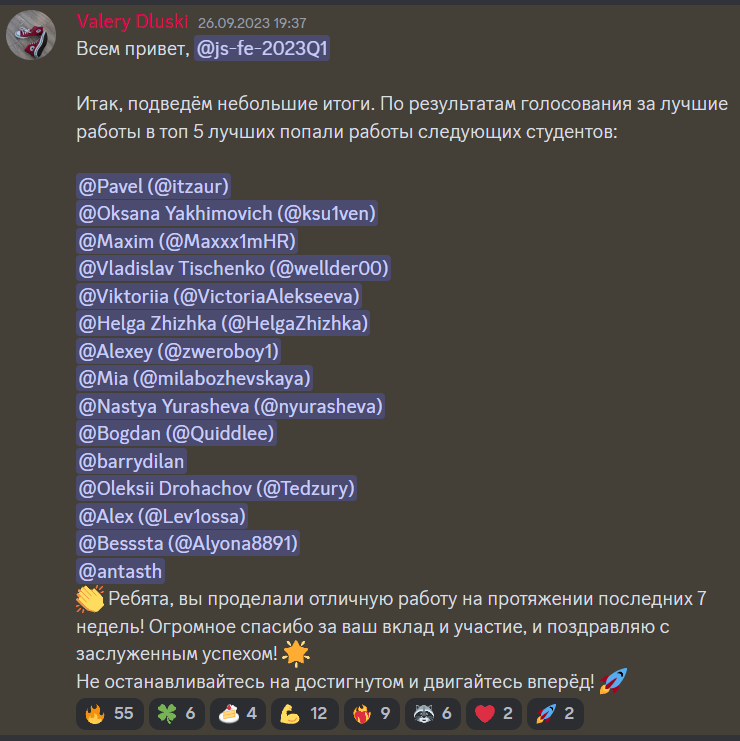

<h1 align="center"> Hey, I'm Max 👋</h1>

<h2 align="center">I am Frontend Developer<h2>
<h3> ♈ About me </h3>

 🚀 I'm a passionate frontend developer with a great desire to learn new technologies. Keen on learning new technologies in web-development. I really like, when I have to-do list for the day and planning tasks for the next day. Most importantly, I'm very stubborn, because I'm aries 🐏  and always reach 🎯, what I want!

❗ <a href="#">My Resume/CV</a>

📠You can check my <a href="https://app.rs.school/cv/dc9a13fa-8742-4637-9207-40a1b82dfabd">RS school CV</a>, with Mentors's Feedback

🥠Also you can check out my <a href="https://www.youtube.com/watch?v=kR-WfIrQdHg">Self-introduction on YouTube</a>

🥠My presentation about JWT token <a href="https://www.youtube.com/watch?v=UwAF4peRPuk">YouTube</a>

<h3 align="left">📬 Reach me out!</h3>

<h3> 🛠️ My tech stack </h3>

<h3>👨‍💻 My projects</h3>

  🏎️ [Async Race](https://github.com/Maxxx1mHR/async-race)  
  💣 [Minesweeper](https://github.com/Maxxx1mHR/minesweeper)  
  🎮 [Css-selectors](https://github.com/Maxxx1mHR/rss-css-selectors)  
  ⌨️ [Virtual keyboard](https://github.com/Maxxx1mHR/virtual-keyboard)  
  🐶 [Shelter](https://github.com/Maxxx1mHR/shelter)  
  ☘️ [Plants](https://github.com/Maxxx1mHR/minesweeper)  
  🎪 [CSS accordeon](https://github.com/Maxxx1mHR/cssBayan)  
  🌆 [Momentum](https://github.com/Maxxx1mHR/momentum)  
  😈 [Curriculum vitae](https://github.com/Maxxx1mHR/rsschool-cv)  

<h3>🎓 Education </h3>
<ul>
  <li>
    <a href="https://www.spbstu.ru">Peter the Great St. Petersburg Polytechnic University</a>
    <ul>
      <li>ALTADM. Alt OS Administration, 4 September 2023 - 29 September 2023, <a href="https://drive.google.com/file/d/10KK8DHK_2gO4kvihNFXNDqvcrw947YZQ/view">certificate</a></li>
    </ul>
  </li>
</ul>
<ul>
  <li>
    <a href="https://wearecommunity.io/communities/the-rolling-scopes">RS school</a>
    <ul>
      <li>
        <a href="https://wearecommunity.io/events/js-fe-rs-2023q1">JavaScript/Frontend</a>, 5 March 2023 - 26 September 2023, <a href="https://app.rs.school/certificate/eqyfqyl5">certificate</a>
      </li>
      <li>
        <a href="https://wearecommunity.io/events/js-stage0-rs-2022q4">JS/FE pre-school JavaScript</a>, 5 December 2022 - 3 March 2023, <a href="https://app.rs.school/certificate/hk4kv8hc">certificate</a>
      </li>
    </ul>
  </li>
</ul>
<ul>
  <li>
    <a href="https://www.udemy.com/">Udemy</a>
    <ul>
      <li>WEB-developer, 13 July - 5 December 2022, <a href="https://www.udemy.com/certificate/UC-f43bac3c-8e53-4214-8129-0a6f3ee3fd48/">certificate</a></li>
    </ul>
  </li>
</ul>
<ul>
    <li>
      <a href="https://en.nntu.ru/">Nizhny Novgorod State Technical University n.a. R.E. Alekseev</a>
      <ul>
        <li>Master’s degree in Computer Science and Engineering, 2020 - 2022</li>
        <li>Bachelor's degree in Computer Science and Engineering, 2016 - 2020</li>
      </ul>
    </li>
</ul>

<h3>👨‍💼 Work experience</h3>
<ul style="list-style-type:none">
    <li>
      <a href="https://uppervolga.transneft.ru/">JSC "Transneft – Upper Volga"</a>
      <ul >
        <li>Engineer of the 1st category of the Information Technology Department (Sector of Information Systems Implementation ), 24 July 2023 - Currently</li>
        <li>Electronics engineer of the 2nd category of the Information Technology Department (Sector of computing and office equipment ), 1 March 2022 - 24 July 2023</li>
        <li>Technician of the Information Technology Department (Sector of computing and office equipment ), 19 August 2020 - 1 March 2022</li>
      </ul>
    </li>
</ul>

<h3>🏆 Achievement</h3>

The best team work of the JavaScript/Frontend 2023Q1! 👑

  
<a href="https://github.com/itzaur/eCommerce-Application">Our work</a> won in a fair vote of 180 works. Students and mentors of the school participated in the voting

  

    
    
  

🔥 Ranked in the top 1% of students by RS school results! 🔥

🐏 Stayed alive after a year of hard work! 🐅🎯

<h3>💻 Codewars</h3>

